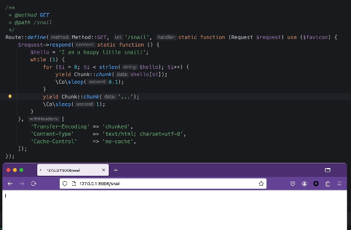

## theme

> "PHP is a programming language, but PHP itself can be considered a framework"

It means that if you master PHP, then you will completely master the `Nos` framework

### Introduction

This is a truly static `PHP` (resident memory) project, derived from an extension of one of my own whims. The views in
this article only represent my humble opinion)
Although it is developed based on the `ripple` coroutine engine and has less than 10 files, in my mind, `ripple` is much
inferior to it.
For this purpose, I prepared an easily disassembled scaffolding **(i.e. the current project)** and passed:

- "Routing"
- "The Running Snail"
- "Buttware"
- "Static Class"
- "Database Connection Pool"
- "Package Reuse"
- "Static Cache"

Typical examples to demonstrate some features of `Nos`. All the examples mentioned in the article can be reproduced with
one click at the end of the article. It is intended to be discussed for entertainment, and please do not take it for
granted.

### It’s all in the code

Start by creating a routing group, which has no controller or middleware, and only needs one file `app/http/readme.php`

```php
<?php declare(strict_types=1);

// Path: app/http/readme.php

Route::define(Method::GET, '/door1',  function (Request $request) {
    $request->respond('is door1.');
});

Route::define(Method::GET, '/door2',  function (Request $request) {
    $request->respond('is door2.');
});
```

and introduced in `app/http/http.php`

```php
<?php declare(strict_types=1);

// Path: app/http/http.php

Package::import('room');

// more...
```

Some students may ask > What is the difference between that and other frameworks? Don’t other frameworks also use
`route.php` to create routes? What about middleware and validators?

I scoff at this ) One day you create a route that returns a `hello,world` but it returns a `world,hello` What do you do?

The difference with `Nos` is that it will take control when the request arrives, such as this code

```php
Route::define(Method::GET, '/snail', static function (Request $request) use ($favicon) {
    $request->respond(static function () {
        $hello = 'I am a happy little snail!';
        while (1) {
            for ($i = 0; $i < strlen($hello); $i++) {
                yield Chunk::chunk($hello[$i]);
                \Co\sleep(0.1);
            }
            yield Chunk::chunk('...');
            \Co\sleep(1);
        }
    }, [
        'Transfer-Encoding' => 'chunked',
        'Content-Type'      => 'text/html; charset=utf-8',
        'Cache-Control'     => 'no-cache',
    ]);
});
```

You will see the following effect when visiting:

> </img>

### Parts

Then someone may ask, if your framework does not have middleware, do you want me to write it in each route?

No, although there is no middleware in `Nos`, there are more powerful software ➡《腚ware》

In the following example, I will randomly create a buttware

```php
<?php declare(strict_types=1);

// Path: app/http/readme.php

// Other routes

/**
 * Randomly picked buttwares
 * @param \Psc\Core\Http\Server\Request $request
 * @return void
 */
function performARunningSnail(Request $request): void
{
    $request->respond(static function () {
        $hello = 'I am a happy little snail!';
        while (1) {
            for ($i = 0; $i < strlen($hello); $i++) {
                yield Chunk::chunk($hello[$i]);
                \Co\sleep(0.1);
            }
            yield Chunk::chunk('...');
            \Co\sleep(1);
        }
    }, [
        'Transfer-Encoding' => 'chunked',
        'Content-Type'      => 'text/html; charset=utf-8',
        'Cache-Control'     => 'no-cache',
    ]);
}

Route::define(Method::GET, '/snail-tail', function (Request $request) {
    performARunningSnail($request);
});
```

In the above example, I created a widget that will provide a running snail for every request.
Can anyone tell me what scenarios cannot be achieved with the software?

### Everything can be quoted

> Note that what I said before about "mastering everything" is not empty talk. For example, I will stop this snail in
> any scene.

I just need to rub a `$list`

```php
//Other routes...

$list = [];
Route::define(
    Method::GET,
    '/snails',
    function (Request $request) use (&$list) {
    
    }
);
```

Yes, I created a `$list` shared by multiple routes and referenced by whoever wants to use it to achieve the goal.

> 创建蜗牛API http://127.0.0.1:8008/snail-tail  
> 停止蜗牛API http://127.0.0.1:8008/snail-stop?id={蜗牛ID}

```php
$list = [];

Route::define(Method::GET, '/snail-tail', function (Request $request) {
    \Co\async(fn () => performARunningSnail($request));

    $stream    = $request->stream;
    $id        = $request->stream->id;
    $list[$id] = $stream;

    $stream->onClose(function () use (&$list, $id) {
        unset($list[$id]);
    });
});

Route::define(Method::GET, '/snail-stop', function (Request $request) use (&$list) {
    if (!$id = $request->GET['id'] ?? null) {
        $request->respond('please provide id.');
        return;
    }

    if (isset($list[$id])) {
        $list[$id]->write(Chunk::chunk('stoooooooooop!'));
        $list[$id]->close();
        $request->respond('snail ' . $id . ' is gone.');
    } else {
        $request->respond('snail ' . $id . ' is not found.');
    }
});
```

In the above example, I used a `$list` to jointly manage a request in two routes, realizing the generation and
termination of a snail.

### Have you mastered PHP?

Students who look at the code carefully will find: the hellish use is simply terrible!!!!!

I want to tell you, I think so too, but I'll tell you the answer soon

```php
<?php

// Path: app/http/readme.php

// Other routes...

Route::define(Method::GET, '/snail-tail', function (Request $request) {
    \Co\async(fn () => performARunningSnail($request));

    $stream          = $request->stream;
    $id              = $request->stream->id;
    Data::$list[$id] = $stream;

    $stream->onClose(function () use (, $id) {
        unset(Data::$list[$id]);
    });
});

Route::define(Method::GET, '/snail-stop', function (Request $request) {
    if (!$id = $request->GET['id'] ?? null) {
        $request->respond('please provide id.');
        return;
    }

    if (isset(Data::$list[$id])) {
        Data::$list[$id]->write(Chunk::chunk('stoooooooooop!'));
        Data::$list[$id]->close();
        $request->respond('snail ' . $id . ' is gone.');
    } else {
        $request->respond('snail ' . $id . ' is not found.');
    }
});


class Data
{
    public static array $list = [];
}
```

Yes, it's that simple. If you are bothered by these `use`, you can share them through static properties.

> Each file defines a `Class Data`, will no error be reported?

^ Students who can ask the above questions suggest rebuilding the namespace of `PHP`. Although it is purely static PHP,
you can also use `namespace`

---

With such convenient development efficiency, who can tell me whether I need objects? What are the uses of objects?

hhh, actually it is still needed, the object also needs `object`

After all, `Session`, `View`, `Container`, `Database` are sometimes inseparable

### Module reference

For example, I have a file like this `app/database/mysql.php`:

```php
<?php declare(strict_types=1);

// Path: /app/database/mysql.php

use Amp\Mysql\MysqlConfig;
use Amp\Mysql\MysqlConnectionPool;

$config = MysqlConfig::fromString("host=tfb-database port=3306 user=benchmarkdbuser password=benchmarkdbpass db=hello_world");

return new MysqlConnectionPool($config);
```

Note that the file returned can be imported in multiple places and return the same reference

#### Return to route `readme.php`

```php
$pool = Package::import('database/mysql');

// Any import will get the same reference
$pool = Package::import('database/mysql');

// Other routes...

Route::define(\Psc\Core\Http\Enum\Method::GET, '/db', function (Request $request) use ($pool, &$dateFormatted) {
    $once = $pool->prepare('SELECT * FROM `World` WHERE id = :id')->execute(['id' => randomInt()]);
    $request->respondJson($once->fetchRow());
});
```

Just do this and you can happily use the database

#### I believe no one likes `use`, so you can do this:

```php
<?php declare(strict_types=1);

// Path: /app/http/readme.php

// Other routes

Data::$mysqlConnectionPool = Package::import('database/mysql');

Route::define(\Psc\Core\Http\Enum\Method::GET, '/db', function (Request $request) use ($pool, &$dateFormatted) {
    $once = $pool->prepare('SELECT * FROM `World` WHERE id = :id')->execute(['id' => randomInt()]);
    $request->respondJson($once->fetchRow());
});

class Data
{
    public static array $list = [];
    public static MysqlConnectionPool $mysqlConnectionPool;
}
```

In fact the topic of this article is:

#### Static! Static!

Why is it said to be a static framework? Because everything in it can be static

For example, refer to static files in memory:

```php
Data::$faviconBinary = Package::import('static/favicon.ico');
Route::define(Method::GET, '/favicon.ico', function (Request $request) {
    $request->respond(Data::$faviconBinary, ['Content-Type' => 'image/x-icon']);
});

class Data
{
    public static array $list = [];
    public static MysqlConnectionPool $mysqlConnectionPool;
    public static string $faviconBinary;
}
```

### Everything can be imported

### End of article

In the above example, pass

- Routing
- running snail
- Buttocks
- static class
- Database connection pool
  -Package reference

It shows some features of the `Nos` framework. In fact, you can also manually build a SessionManager, a View, a
Container, or even the entire
`Laravel/Application` Of course this is a big project, I believe you can do it

The following is a one-click deployment experience

#### Install

```bash
composer create-project --stability=dev cloudtay/nos
```

#### Extras

> The database of this project uses the `techempower/mysql:latest` data example. You can start it with the following
> command to ensure that each step can be reproduced.

```bash
docker run -d --name tfb-database -p 3306:3306 techempower/mysql:latest
````

#### Run the application

```bash
NOS_APP_PATH=app vendor/bin/nos
```

#### Optional parameters

```bash
NOS_APP_PATH=app \
NOS_HTTP_LISTEN=http://127.0.0.1:8080 \
NOS_HTTP_WORKER=1 \
vendor/bin/nos
```
